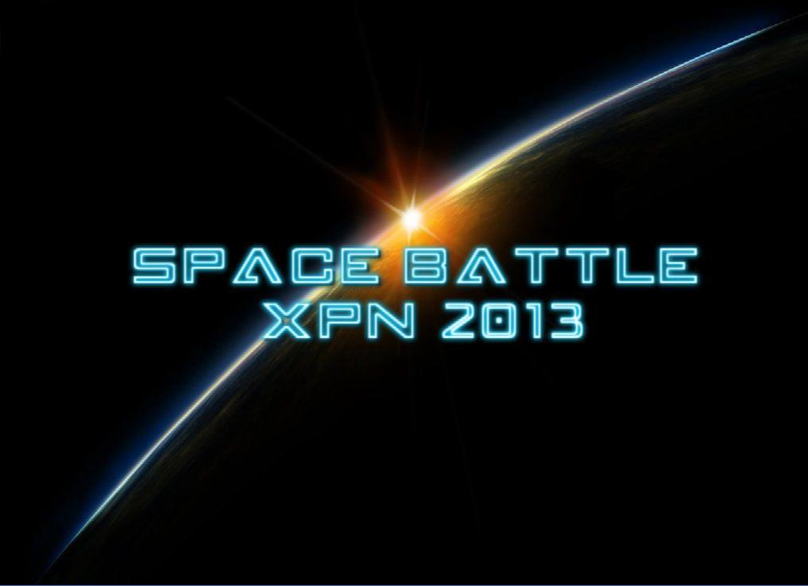
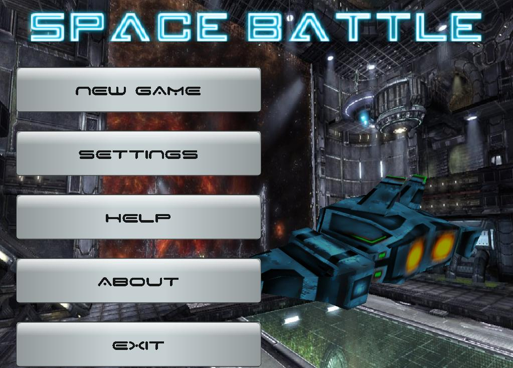
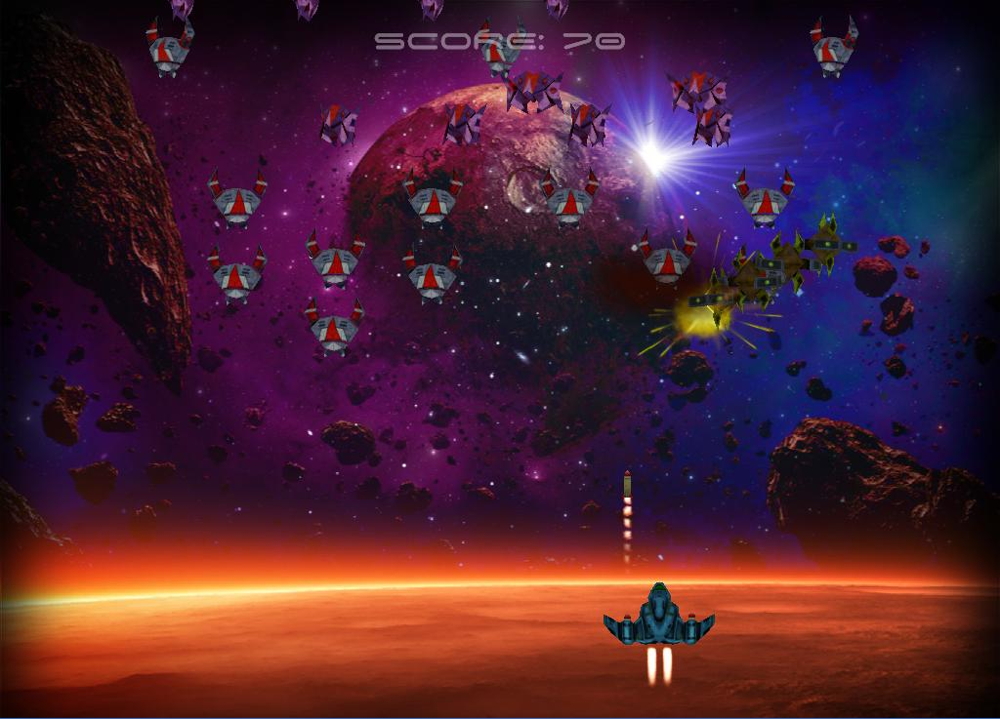

Space Battle XPN 2013 Kiev
--------------------------

Space Battle is a simple arcade game for PC based on well-known [Space Invaders][1]. 

Tools and resources
--------------------------

Game was created with an open source realtime 3D engine [Irrlicht Engine 1.8][2].
Sound supporting is implemented with the [audiere][3] library.

Sources of resources:

* Sounds and music: http://www.freesound.org/
* Headlines and buttons: http://cooltext.com/
* 3d models, game requirements and scenario: [XPN 2013][4].

Screenshots
-------------------------

Feedback
-------------------------
Game created by Denis Panchenko actor07@ukr.net

[1]: http://en.wikipedia.org/wiki/Space_Invaders "Space Invaders"
[2]: http://irrlicht.sourceforge.net/ "Irrlicht Engine 1.8"
[3]: http://audiere.sourceforge.net/ "audiere"
[4]: http://xpn.gameloft.com/ "XPN 2013"
